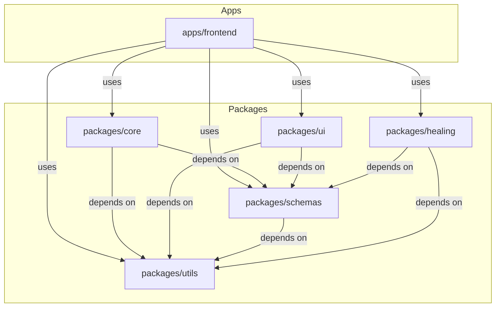

## Codex Dominion Monorepo Constellation

```mermaid
graph TD
    A[apps/frontend] -->|uses| B[packages/core]
    A -->|uses| C[packages/utils]
    A -->|uses| D[packages/ui]
    A -->|uses| E[packages/schemas]
    A -->|uses| F[packages/healing]
    B -->|depends on| C
    B -->|depends on| E
    D -->|depends on| C
    D -->|depends on| E
    E -->|depends on| C
    F -->|depends on| C
    F -->|depends on| E
    subgraph Packages
        B
        C
        D
        E
        F
    end
    subgraph Apps
        A
    end
```

> _This constellation diagram maps the relationships between your monorepo's apps and packages, visually narrating the cosmic metaphor of Codex Dominion._
